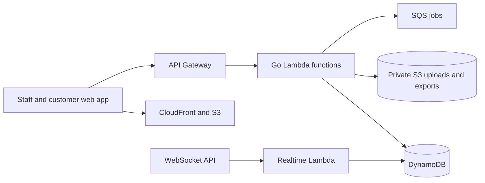

<div align="center">


# BeepBite

### Restaurant POS, kitchen, inventory and online ordering.

One web platform for the counter, kitchen, floor, delivery and customer orders.
The application runs on AWS serverless infrastructure: Go Lambdas, DynamoDB,
API Gateway, S3 and CloudFront.

[](CHANGELOG.md)
[](LICENSE-MIT)
[](infra/aws/README.md)
[](https://golang.org)
[](https://react.dev)

[Features](#features) · [Architecture](#architecture) · [Development](docs/development.md) · [Deployment](infra/aws/README.md)

<br/>


</div>

---

## What is BeepBite?

BeepBite is a restaurant operations platform with a point of sale, kitchen
display, floor plan, inventory, reports, delivery tools and a public ordering
storefront. Staff use it in a browser; customers can order from the restaurant's
web link and follow order status.

The active backend is serverless. Orders, menus, customers and tenant data are
stored in DynamoDB; Go Lambda functions expose the API. PostgreSQL is not part
of the deployed architecture. Development deployments are managed by GitHub
Actions and Terraform; see the [AWS setup guide](infra/aws/README.md).

BeepBite does not process card payments. It records cash, card-machine and
other tenders. WhatsApp messaging is optional and requires the restaurant's
own credentials.

> **Status:** pre-1.0 and under active development. Check the deployed
> environment before relying on a workflow for live operations.

## Features

| Restaurant operations | Orders and customers |
|---|---|
| POS, tables and floor plan | Public storefront and web checkout |
| Kitchen display and expo | Delivery, pickup and dine-in order modes |
| Inventory, recipes and purchasing | Private customer order tracking |
| Cash drawer and tender records | Optional WhatsApp link and notifications |
| Reports, staff and permissions | Driver assignment and delivery status |

## Architecture



There is no PostgreSQL service, migration runner, or standalone Go HTTP server
in the supported deployment. Tenant-scoped records are stored in DynamoDB
partitions and accessed through the serverless API.

## Run the web app against development

Install Node.js 20+, copy `.env.example` to `.env`, and run:

```bash
cd web
npm ci
npm run dev
```

The example points to the shared development API. Local browser development
therefore uses the development DynamoDB data; avoid destructive testing against
shared records. For isolated changes, use a dedicated AWS development stack.

## Checks

```bash
cd backend
go test ./cmd/serverless/... ./pkg/...
go vet ./cmd/serverless/... ./pkg/...

cd ../web
npm run typecheck
npm run test:unit
```

CI builds the Lambda packages and frontend on every push and pull request.
Merged changes to `develop` deploy through the
[development workflow](.github/workflows/deploy-development.yml).

## More information

- [AWS deployment and infrastructure](infra/aws/README.md)
- [Development guide](docs/development.md)
- [User guide](docs/user-guide.md)
- [Troubleshooting](docs/troubleshooting.md)
- [Features and current limits](docs/features.md)
